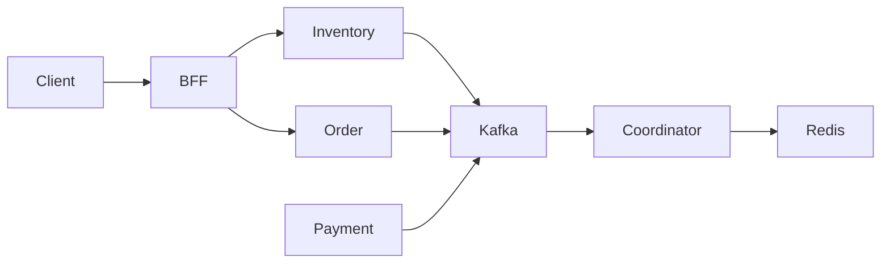

# Event-Driven Order Workflow POC

A proof-of-concept project exploring distributed transaction workflows using event-driven architecture.

## This project focuses on:
* Distributed transaction coordination
* Event-driven workflow orchestration
* Eventual consistency
* Idempotency handling
* Inventory freeze / commit / rollback workflow
* Async request-response processing
* Service-to-service communication using Kafka

---

## Overview
This project simulates a simplified e-commerce order transaction workflow in a distributed microservice architecture.

### The workflow includes:
1. Freeze inventory
2. Create order
3. Create payment transaction
4. Coordinate async events
5. Complete payment
6. Commit inventory
7. Complete order

The system uses asynchronous event-driven communication to maintain eventual consistency between services.

---

## Architecture

### Services
| Service | Responsibility |
| :--- | :--- |
| **bff-service** | Client-facing API layer, asynchronous request handling, response aggregation |
| **order-service** | Order creation and status management |
| **payment-service** | Payment workflow simulation |
| **storage-service** | Inventory freeze / commit / rollback |
| **coordinate-service** | Workflow orchestration |
| **gateway-service** (optional) | API gateway / routing |
| **redis** | Distributed lock / idempotency |
| **kafka** | Event bus |
| **mariadb** | Persistent storage |




### Workflow: Order Creation Flow
`Client` -> `order-service` -> `freeze inventory event` -> `storage-service` -> `inventory frozen` -> `create payment event` -> `payment-service` -> `payment completed` -> `commit inventory` -> `complete order`

---

## Event-Driven Transaction Model
This project uses:
* **Event-driven workflow orchestration**: Saga-like transaction coordination.
* **Eventual consistency model**: Instead of using distributed XA transactions, services communicate asynchronously through Kafka events.

### Core Concepts

#### 1. Inventory Freeze Pattern
Inventory is not deducted immediately. The workflow is:
* `freeze` → `commit` OR `freeze` → `rollback`
This prevents overselling during asynchronous transaction processing.

#### 2. Idempotency Handling
The system includes request deduplication logic using Redis to:
* Prevent duplicate order creation
* Prevent duplicated event processing
* Prevent repeated workflow execution

#### 3. Async Request-Response
The API layer uses Spring `DeferredResult` to support asynchronous workflow completion. The request thread does not block while waiting for downstream event processing.

#### 4. Transaction After Commit Event Publishing
Kafka events are published after database commit using transaction synchronization callbacks. This avoids publishing events before transaction persistence succeeds.

---

## Technologies
| Category | Stack |
| :--- | :--- |
| Language | Java |
| Framework | Spring Boot |
| Messaging | Kafka |
| Cache | Redis |
| Database | MariaDB |
| Service Discovery | Nacos |
| Async API | DeferredResult |
| Build Tool | Maven |

---

## Current Limitations
*This project is currently a POC and is **NOT** production-ready.*
* Workflow state stored in memory
* No durable workflow persistence / No distributed tracing
* No reconciliation job / event replay mechanism
* No observability dashboard / chaos testing
* No outbox pattern implementation

---

## Future Improvements
* OpenTelemetry tracing & Prometheus + Grafana metrics
* Workflow persistence & Event replay support
* Reconciliation jobs & Chaos engineering tests
* Spring Cloud Gateway integration
* JWT authentication & Kubernetes deployment

---

## Goals & Non-Goals

### Goals
* Learning distributed system design
* Exploring eventual consistency models
* Practicing event-driven architecture
* Understanding transaction coordination tradeoffs

### Non-Goals
* A production-ready e-commerce platform
* A complete payment system
* A fully secured platform
* A high-availability deployment solution

---

## Repository Structure
```text
.
├── bff-service
├── order-service
├── payment-service
├── storage-service
├── coordinate-service
├── common
└── docs